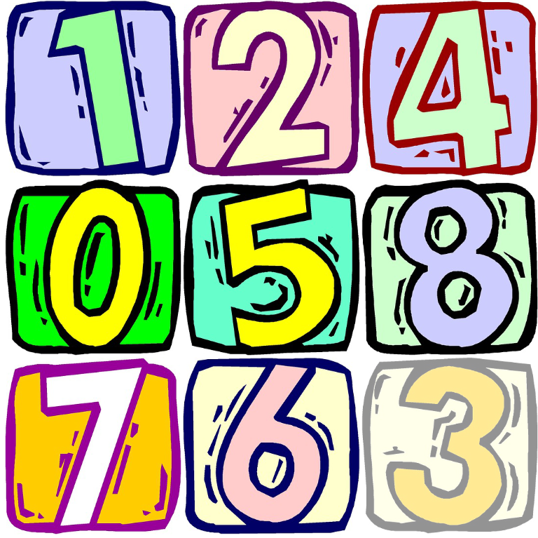
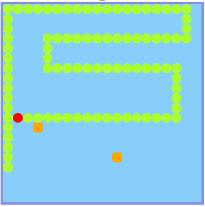

lerning vue by port [my vanilla repo](https://github.com/cuteapple/web-items) to vue 

---

- the only library is *vue.js*

- easy, simple and clean code

- welcome for topic suggestion

---

- [ooxx](https://cuteapple.github.io/web-items-vue/ooxx/)

difference:

 - do not use :after pseudo element

---

- [8-puzzle](https://cuteapple.github.io/web-items-vue/8-puzzle/)

difference:

 - random cursor number
 - 🎉 emoji for finish

---

- [🐍snake🐍](https://cuteapple.github.io/web-items-vue/snake/)

difference:

 - support multiple foods
 - 🐍
 - configurable

---
